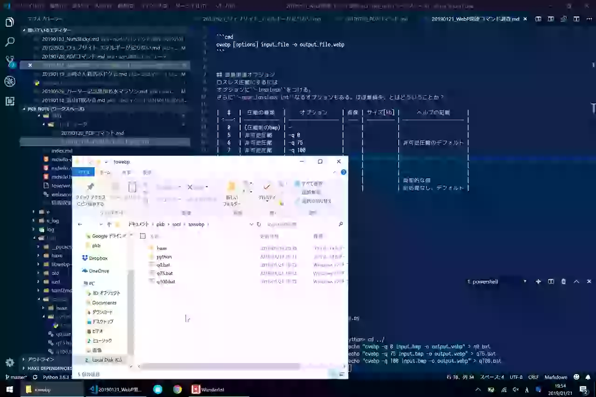
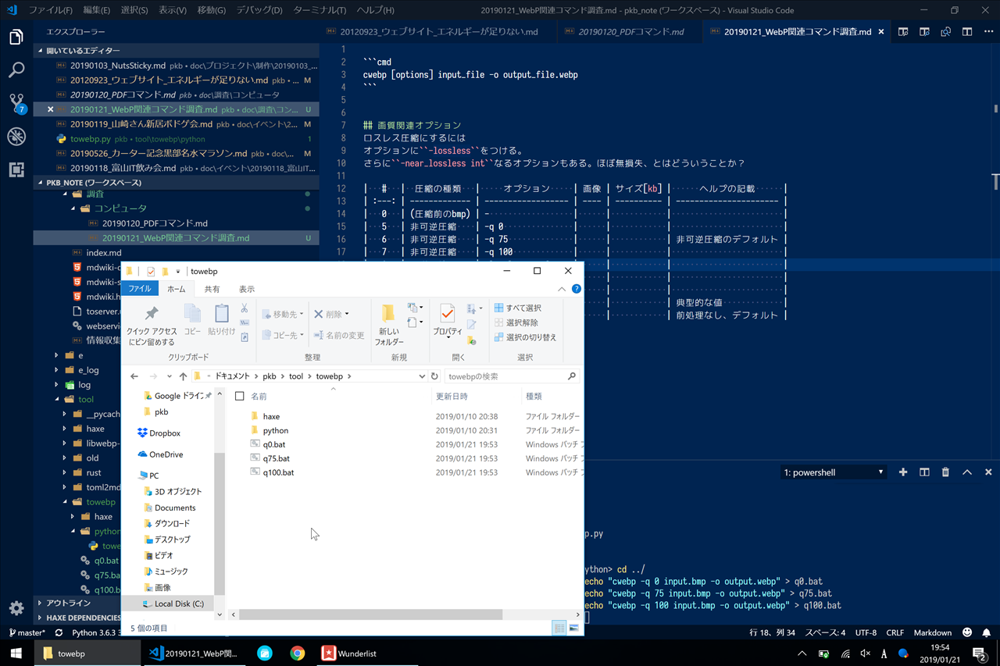

```cmd
cwebp [options] input_file -o output_file.webp
```


## 画質関連オプション
ロスレス圧縮にするには
オプションに``-lossless``をつける。-qの意味は圧縮率になる。
さらに``-near_lossless int``なるオプションもある。直訳でほぼ無損失。
100の場合はそのままlosslessと同じ。0に近づくほど、若干損失させるみたい。可逆でも非可逆でもないような。

写真とスクショでサイズ比較してみる。

### 写真
|   #   |  圧縮の種類   |        オプション        |            画像             | サイズ[kb] |      ヘルプの記載      |               備考               |
| :---: | ------------- | ------------------------ | --------------------------- | ---------- | ---------------------- | -------------------------------- |
|   1   | (圧縮前のbmp) | -                        |             |            |                        |                                  |
|   2   | 非可逆圧縮    | -q 0                     |        |            |                        |                                  |
|   3   | 非可逆圧縮    | -q 75                    |       |            | 非可逆圧縮のデフォルト |                                  |
|   4   | 非可逆圧縮    | -q 100                   |      |            |                        |                                  |
|   5   | 可逆圧縮      | -lossless -q 0           |       |            |                        |                                  |
|   6   | 可逆圧縮      | -lossless -q 75          |      |            | 可逆圧縮のデフォルト   |                                  |
|   7   | 可逆圧縮      | -lossless -q 100         |     |            |                        | 体感できるほど処理に時間がかかる |
|   8   | ほぼ無損失    | -near_lossless 0         |       |            |                        |                                  |
|   9   | ほぼ無損失    | -near_lossless 60        |      |            | 典型的な値             | -qはデフォ75のよう               |
|  10   | ほぼ無損失    | -near_lossless 100       |     |            | 前処理なし、デフォルト |                                  |
|  11   | ほぼ無損失    | -near_lossless 60 -q 0   |    |            |                        |                                  |
|  12   | ほぼ無損失    | -near_lossless 60 -q 100 |  |            |                        |                                  |

#### (圧縮前のbmp)


#### 非可逆圧縮
##### 品質0
```
-q 0
```


##### 品質75
非可逆圧縮のデフォルト
```
-q 75
```


##### 品質100
```
-q 100
```


#### 可逆圧縮
##### 品質0
```
-lossless -q 0
```


##### 品質75
```
-lossless -q 75
```

 可逆圧縮のデフォルト

##### 品質100
```
-lossless -q 100
```


体感できるほど処理に時間がかかる
#### ほぼ無損失(品質75固定・無損失レベルを変動)
```
-near_lossless 0
```


```
-near_lossless 60
```

典型的な値
-qはデフォ75のよう
```
-near_lossless 100
```

前処理なし、デフォルト

#### ほぼ無損失(損失レベル60固定・品質を変動)
##### 品質0
```
-near_lossless 60 -q 0
```


##### 品質100
```
-near_lossless 60 -q 100
```


### スクリーンショット


別途、可逆の場合は``-z``でプリセット(0:fast, ... , 9:slowest)で指定できる。、可逆の場合は``-m``というオプションもある。

## プリセット
``-preset <string>``でモードを指定できるようだ。
選べるのは、``default, photo, picture, drawing, icon, text``とのこと。
写真はフォト、絵はpicture、図形はdrawing、で、iconは何？文字はtextということかな。
スクショならdrawingかtextがいいのかな。
